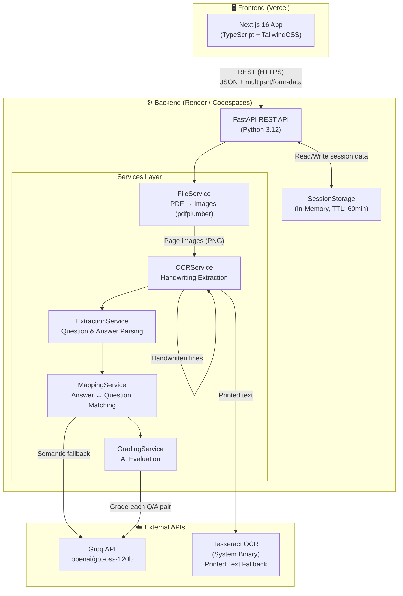
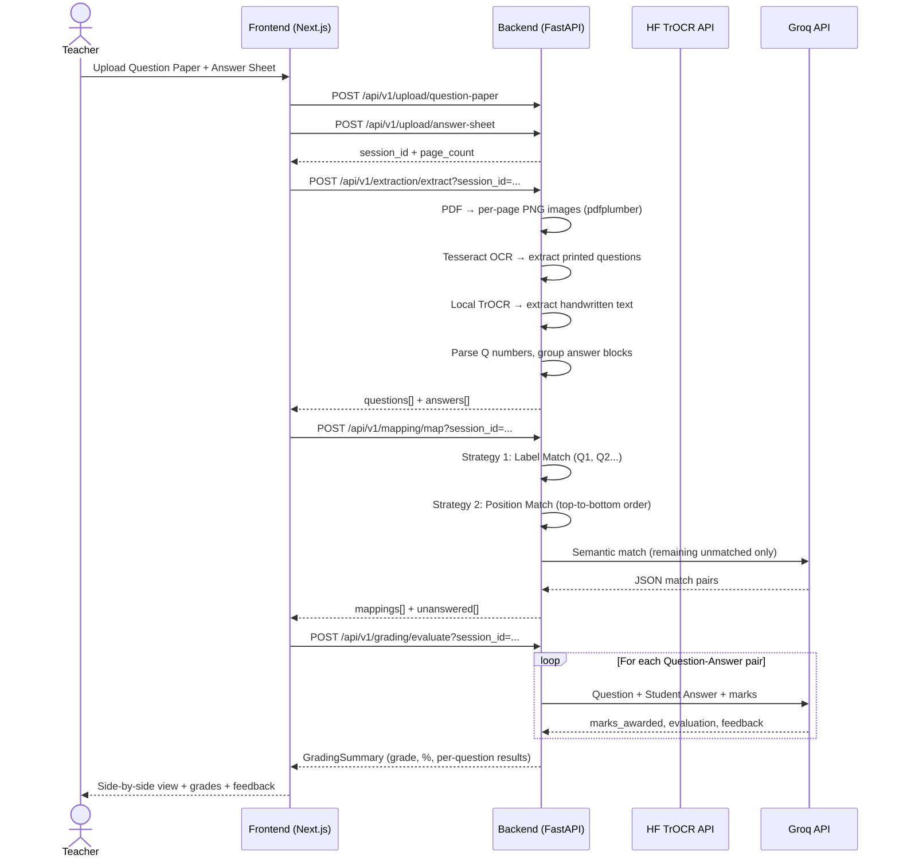
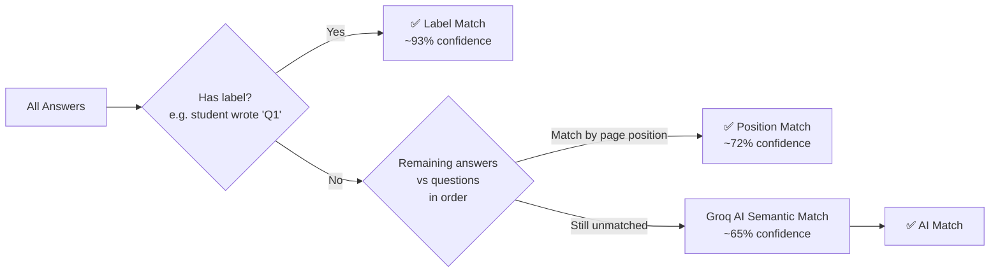

# AI Assessment Extraction & Answer Mapping

An intelligent full-stack web application that enables teachers to upload question papers and student answer sheets, automatically extract and map handwritten answers to questions using OCR + AI, and generate detailed grading feedback per question.

---

## Architecture Diagram



---

## System Data Flow



---

## Core Features

- **File Upload & Processing** — Accepts question papers and answer sheets as PDF or images (JPG/PNG). PDFs are converted to per-page images before processing.
- **Question Extraction** — Tesseract OCR + regex parses printed question numbers (`Q1`, `1.`, `(a)`, etc.) preserving hierarchy.
- **Handwritten Answer Extraction** — OpenCV horizontal projection segments text lines. Each line crop is passed to the local **TrOCR model** (`microsoft/trocr-base-handwritten`). Falls back to Tesseract on low confidence.
- **Answer Mapping** — Three-strategy matching engine: label match → position match → Groq AI semantic match.
- **AI Grading** — Each question-answer pair is evaluated by **Groq** (`openai/gpt-oss-120b`). Returns: marks awarded, evaluation type (correct/partial/incorrect), and student feedback.
- **Session Management** — In-memory session store with 60-minute TTL and automatic background cleanup.

---

## Tech Stack

### Frontend
| Technology | Version | Purpose |
|---|---|---|
| **Next.js** | 16.3.3 | App framework (App Router) |
| **TypeScript** | 5.x | Type safety |
| **TailwindCSS** | 3.x | Styling |
| **Lucide React** | Latest | Icons |

### Backend
| Technology | Version | Purpose |
|---|---|---|
| **FastAPI** | 0.111.0 | REST API framework |
| **Uvicorn** | 0.30.1 | ASGI server |
| **Pydantic v2** | 2.7.4 | Data validation & settings |
| **pdfplumber** | 0.11.1 | PDF → image conversion |
| **Pillow** | 10.3.0 | Image manipulation |
| **OpenCV** | 4.10.0 | Line segmentation for handwriting |
| **NumPy** | 1.26.4 | Image array processing |
| **pytesseract** | 0.3.13 | Printed text OCR (fallback) |
| **transformers / torch** | 4.41 / 2.3 | TrOCR handwriting extraction |
| **httpx** | 0.27 | HTTP calls to Groq API |

### External APIs
| API | Model | Purpose |
|---|---|---|
| **Groq API** | `openai/gpt-oss-120b` | Answer grading + semantic mapping |

---

## Project Structure

```
.
├── backend/
│   ├── main.py                  # FastAPI app entrypoint + lifespan
│   ├── config.py                # Pydantic Settings (loads from .env)
│   ├── requirements.txt
│   ├── Dockerfile
│   ├── .env.example
│   │
│   ├── core/
│   │   ├── exceptions.py        # Custom exception classes
│   │   ├── constants.py         # Regex patterns, thresholds, grade scales
│   │   └── logging_config.py   # Structured logging setup
│   │
│   ├── models/
│   │   ├── enums.py             # SessionStatus, EvaluationType, MappingMethod
│   │   ├── domain.py            # Internal dataclasses (Question, Answer, Session…)
│   │   └── schemas.py           # Pydantic API request/response schemas
│   │
│   ├── storage/
│   │   └── session_storage.py   # Thread-safe in-memory store + background cleanup
│   │
│   ├── services/
│   │   ├── file_service.py      # Upload handling + PDF→PNG conversion
│   │   ├── ocr_service.py       # Local TrOCR + Tesseract fallback
│   │   ├── extraction_service.py# Question/Answer parsing from OCR output
│   │   ├── mapping_service.py   # 3-strategy answer↔question matcher
│   │   ├── grading_service.py   # Groq AI evaluation per Q/A pair
│   │   └── vision_service.py    # Groq Vision wrapper (image quality, etc.)
│   │
│   ├── api/
│   │   ├── routes.py            # Router aggregation
│   │   ├── dependencies.py      # FastAPI dependency injection (singleton services)
│   │   └── v1/endpoints/
│   │       ├── upload.py        # POST /upload/question-paper, /upload/answer-sheet
│   │       ├── extraction.py    # POST /extraction/extract, GET /extraction/status
│   │       ├── mapping.py       # POST /mapping/map
│   │       ├── grading.py       # POST /grading/evaluate
│   │       └── data.py          # GET session data (questions, answers, results)
│   │
│   ├── utils/
│   │   ├── image_utils.py       # PIL helpers (resize, enhance, crop, base64)
│   │   ├── pdf_utils.py         # Page count, PDF type detection
│   │   ├── text_processing.py   # Clean, normalize, parse question numbers
│   │   ├── bounding_box_utils.py# Merge, scale, IoU, sort bounding boxes
│   │   └── validators.py        # File size/extension/MIME validation
│   │
│   ├── middleware/
│   │   └── cors_middleware.py   # CORS configuration
│   │
│   └── tests/
│       ├── conftest.py
│       ├── test_api.py
│       ├── test_services.py
│       └── test_utils.py
│
└── frontend/
    ├── app/                     # Next.js App Router pages
    ├── components/              # Reusable UI components
    └── lib/                     # API client, types, utilities
```

---

## Setup Guide

### Prerequisites
- **Node.js** v18+
- **Python** 3.9+
- **Tesseract OCR** (for printed text extraction)
  - macOS: `brew install tesseract`
  - Linux: `sudo apt-get install tesseract-ocr`
- **Groq API Key** → [console.groq.com](https://console.groq.com)

### Backend Setup
```bash
cd backend

# Install dependencies
pip install -r requirements.txt

# Configure environment
cp .env.example .env
# Fill in GROQ_API_KEY in .env

# Run the server
uvicorn main:app --host 0.0.0.0 --port 8000 --reload
```

Backend runs at `http://localhost:8000`  
Swagger docs at `http://localhost:8000/docs`

### Frontend Setup
```bash
cd frontend

npm install

# Set the backend URL
cp .env.example .env.local
# Set NEXT_PUBLIC_API_URL=http://localhost:8000 (or your deployed backend URL)

npm run dev
```

Frontend runs at `http://localhost:3000`

---

## API Reference

| Method | Endpoint | Description |
|---|---|---|
| `GET` | `/health` | Server health check |
| `POST` | `/api/v1/sessions` | Create a new session |
| `POST` | `/api/v1/upload/question-paper` | Upload question paper (PDF/image) |
| `POST` | `/api/v1/upload/answer-sheet` | Upload answer sheet (PDF/image) |
| `POST` | `/api/v1/extraction/extract` | Run OCR + question/answer extraction |
| `GET` | `/api/v1/extraction/status` | Poll extraction progress |
| `POST` | `/api/v1/mapping/map` | Map answers to questions |
| `POST` | `/api/v1/grading/evaluate` | AI-grade all question-answer pairs |
| `GET` | `/api/v1/data/questions` | Fetch extracted questions |
| `GET` | `/api/v1/data/answers` | Fetch extracted answers |
| `GET` | `/api/v1/data/results` | Fetch full grading results |

---

## Environment Variables

### Backend (`.env`)

| Variable | Required | Description |
|---|---|---|
| `GROQ_API_KEY` | ✅ | Groq API key for grading & semantic matching |
| `CORS_ORIGINS` | ✅ | Comma-separated allowed frontend origins |
| `TROCR_MODEL` | ❌ | HF model string (default: `microsoft/trocr-base-handwritten`) |
| `USE_GPU` | ❌ | Set `true` to run TrOCR on GPU (default: `false`) |
| `DISABLE_TROCR` | ❌ | Set `true` to use only Tesseract (saves RAM) |
| `SESSION_STORAGE_PATH` | ❌ | Where session files are stored (default: `./sessions`) |
| `MAX_FILE_SIZE_MB` | ❌ | Max upload size (default: `50`) |
| `SESSION_EXPIRY_MINUTES` | ❌ | Session TTL (default: `60`) |
| `TESSERACT_PATH` | ❌ | Path to Tesseract binary if not in PATH |
| `LOG_LEVEL` | ❌ | Logging verbosity (default: `INFO`) |

### Frontend (`.env.local`)

| Variable | Required | Description |
|---|---|---|
| `NEXT_PUBLIC_API_URL` | ✅ | Backend base URL |

---

## Deployment

### Backend → Railway (Recommended)
Since TrOCR runs locally, it requires ~2.5GB of RAM. Railway's Hobby tier supports up to 8GB of RAM and gives you a free $5 credit (which lasts ~3-4 weeks for this app).

1. Push code to GitHub.
2. Sign in to [Railway.app](https://railway.app).
3. Create a **New Project** → **Deploy from GitHub repo**.
4. Select your repo. Railway will automatically detect the `Dockerfile`.
5. Under Variables, add `GROQ_API_KEY` and `CORS_ORIGINS`.
6. Deploy. Railway gives you a permanent public URL.

### Frontend → Vercel
1. Import repository at [vercel.com](https://vercel.com).
2. Set **Root Directory** to `frontend`.
3. Add `NEXT_PUBLIC_API_URL` pointing to your Render backend URL.
4. Deploy.

---

## How Answer Mapping Works

The mapping engine runs three strategies in order of priority:



---

*Built for the VedAI Hiring Assignment.*
